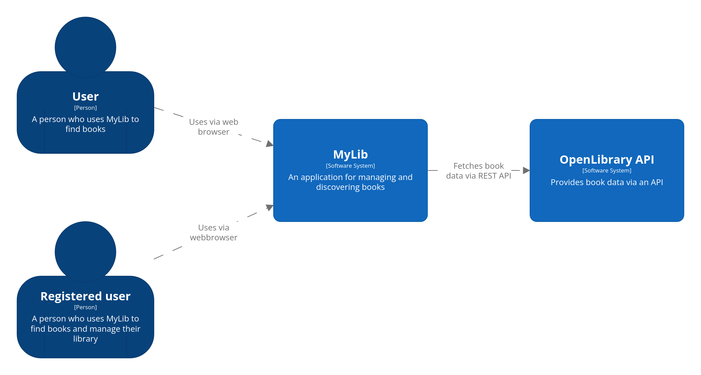

## 1. Introduction And Goals

## 1.1 Purpose

MyLib is a personal library management system allowing users to search for books via the OpenLibrary API and manage a private collection. Users can:

- Search for books
- View book details (cover, title, authors, description, publish date, ISBNs, average rating by all users in the system)
- Add books to a personal library or wishlist
- Transfer books directly from wishlist to library
- Assign personal ratings (1–5) to books in the library
- Manage reading status (unread, currently reading, already read)
- View an aggregated overview of books owned amd wished for by all users (anonymized)

MyLib exposes public endpoints for searching and viewing book details, and secured endpoints for user-specific operations.

## 1.2 Stakeholders

| Stakeholder             | Description                                               |
|--------------------------|-----------------------------------------------------------|
| End Users               | Individuals managing personal book collections            |
| Me                      | Building the system, wanting to pass the course          |
| University Lecturers    | Evaluators of the system for SQS project compliance       |
| External Service Provider | OpenLibrary, providing book data via public API        |

## 1.3 Quality Goals

| Priority | Quality Goal                           | Description                                                       |
|----------|----------------------------------------|-------------------------------------------------------------------|
| High     | Security                               | All user-specific operations secured (authentication, authorization). |
| High     | Resilience                             | Fault-tolerant integration with OpenLibrary API.                  |
| High     | Maintainability                        | Modular architecture; clean code without static analysis issues. |
| Medium   | Performance                            | Reasonably fast response times for book searches and user operations. |
| Medium   | Usability                              | Simple and intuitive user interface.                             |

## 2. Constraints

Due to the requirements given by the lecuturer, the project has the following constraints:re

- Programming languages allowed:
  - Python
  - TypeScript
  - Java
  - C#
- Must provide:
  - At least one publicly accessible endpoint
  - At least one secured endpoint
  - Three-layer architecture:
    - Frontend
    - Backend
    - Persistence layer
- Backend must integrate with at least one external service
- Must use GitHub for source code and version management
- Must GitHub Actions for pipelines

- Further personal constraints:
    - Limited experience in backend development
    - No experience in frontend development

This project was developed under time pressure due to delays in my bachelors thesis.

## 3. System Scope and Context

MyLib is a web application directly accessed by users via a web browser.

Two user types interact with the system:

- **Unregistered User**
  - Can search for books via the OpenLibrary API
  - Can view details about books
  - Can view the aggregated list of books saved by all registered users (anonymized)

- **Registered User**
  - Has all capabilities of an unregistered user
  - Can add books to a personal library
  - Can add books to a wishlist
  - Can transfer books from wishlist to library
  - Can set personal ratings for books (1–5)
  - Can manage reading status for books in the library (unread, currently reading, already read)

MyLib communicates with the following external system:

- **OpenLibrary API**
  - Provides book metadata (titles, authors, covers, descriptions, etc.)
  - Accessed via REST API

## 4. Solution Strategy

## 5. Runtime View

## 6. Deployment View

## 7. Crosscutting Concepts

## 8. Architectural Desicions

## 9. Quality Scenarios

