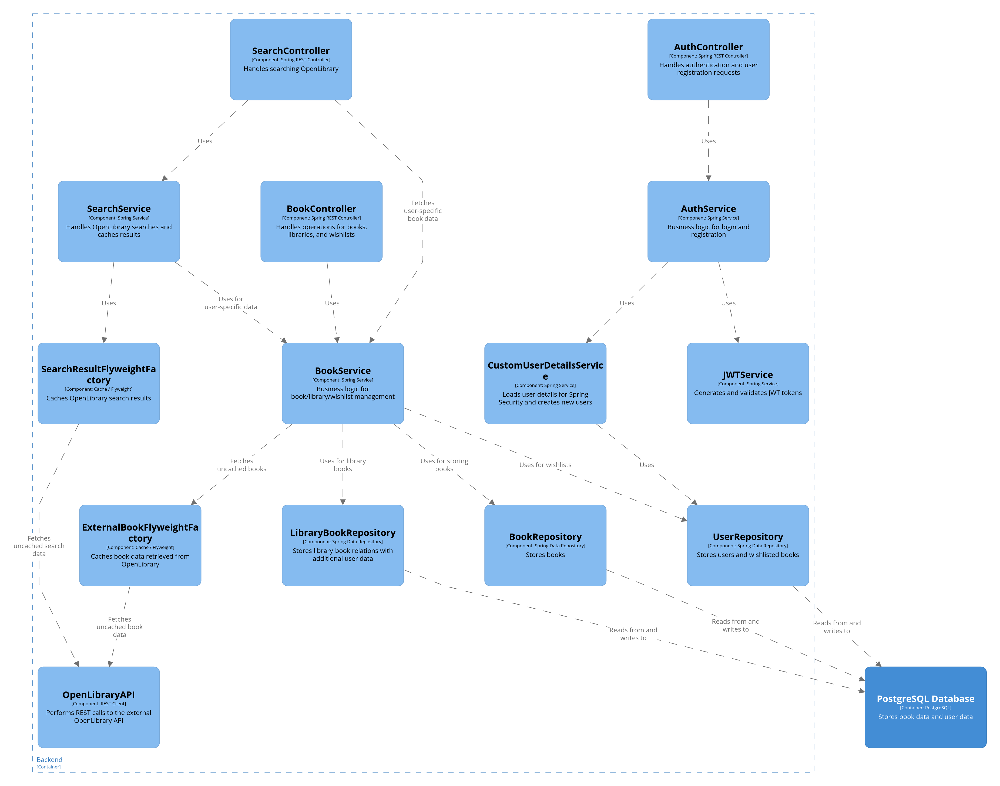
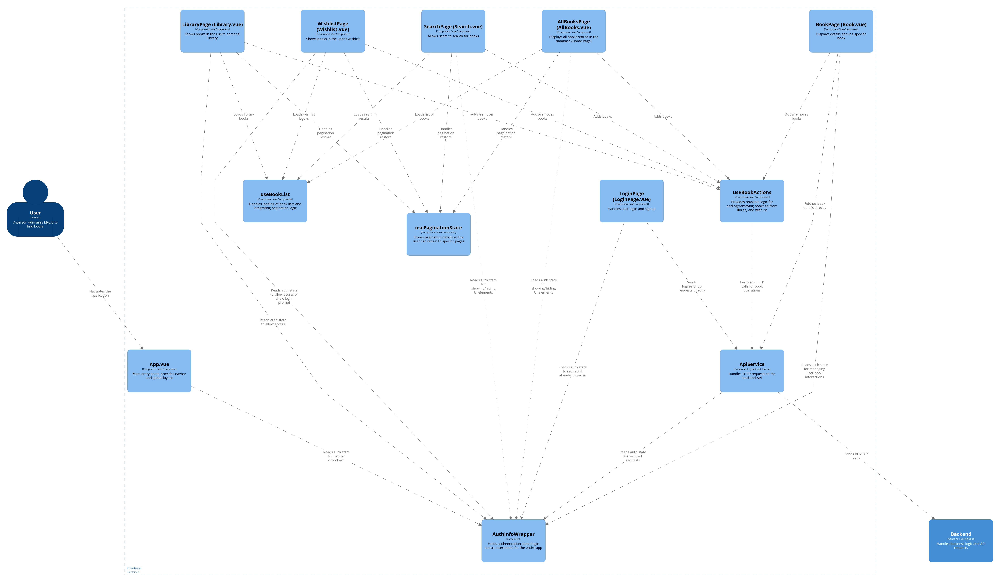
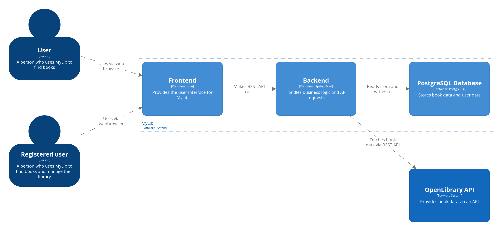

## 1. Introduction And Goals

## 1.1 Purpose

MyLib is a personal library management system allowing users to search for books via the OpenLibrary API and manage a private collection. Users can:

- Search for books
- View book details (cover, title, authors, description, publish date, ISBNs, average rating by all users in the system)
- Add books to a personal library or wishlist
- Transfer books directly from wishlist to library
- Assign personal ratings (1–5) to books in the library
- Manage reading status (unread, currently reading, already read)
- View an aggregated overview of books owned amd wished for by all users (anonymized)

MyLib exposes public endpoints for searching and viewing book details, and secured endpoints for user-specific operations.

## 1.2 Stakeholders

| Stakeholder             | Description                                               |
|--------------------------|-----------------------------------------------------------|
| End Users               | Individuals managing personal book collections            |
| Me                      | Building the system, wanting to pass the course          |
| University Lecturers    | Evaluators of the system for SQS project compliance       |
| External Service Provider | OpenLibrary, providing book data via public API        |

## 1.3 Quality Goals

| Priority | Quality Goal                           | Description                                                       |
|----------|----------------------------------------|-------------------------------------------------------------------|
| High     | Security                               | All user-specific operations secured (authentication, authorization). |
| High     | Resilience                             | Fault-tolerant integration with OpenLibrary API.                  |
| High     | Maintainability                        | Modular architecture; clean code without static analysis issues. |
| Medium   | Performance                            | Reasonably fast response times for book searches and user operations. |
| Medium   | Usability                              | Simple and intuitive user interface.                             |

## 2. Constraints

Due to the requirements given by the lecuturer, the project has the following constraints:re

- Programming languages allowed:
  - Python
  - TypeScript
  - Java
  - C#
- Must provide:
  - At least one publicly accessible endpoint
  - At least one secured endpoint
  - Three-layer architecture:
    - Frontend
    - Backend
    - Persistence layer
- Backend must integrate with at least one external service
- Must use GitHub for source code and version management
- Must GitHub Actions for pipelines

- Further personal constraints:
    - Limited experience in backend development
    - No experience in frontend development

This project was developed under time pressure due to delays in my bachelors thesis.

## 3. System Scope and Context

MyLib is a web application directly accessed by users via a web browser.

Two user types interact with the system:

- **Unregistered User**

  - Can search for books via the OpenLibrary API
  - Can view details about books
  - Can view the aggregated list of books saved by all registered users (anonymized)

- **Registered User**

  - Has all capabilities of an unregistered user
  - Can add books to a personal library
  - Can add books to a wishlist
  - Can transfer books from wishlist to library
  - Can set personal ratings for books (1–5)
  - Can manage reading status for books in the library (unread, currently reading, already read)

MyLib communicates with the following external system:

- **OpenLibrary API**

  - Provides book metadata (titles, authors, covers, descriptions, etc.)
  - Accessed via REST API

## 4. Solution Strategy

### Backend

The backend is implemented in **Spring Boot** (Java). Reasons for this choice:

- Prior experience with the framework
- Widespread adoption and large community support
- Strong integration with persistence frameworks such as Hibernate
- Built-in support for security and REST API development

### Frontend

The frontend is implemented with **Vue.js** and **TypeScript**. Reasons:

- Simplicity and lower learning curve for a single-developer project
- Good documentation and tooling
- Allows type safety via TypeScript

### Database

**PostgreSQL** is used as the database system. Integrated with Spring Boot via Hibernate, enabling:

- Database interaction without custom SQL statements
- Automatic handling of database connections and transactions
- Protection against SQL injection via prepared statements
- Straightforward configuration within Spring Boot projects

### Deployment

Deployment uses **Docker Compose**, bundling all system components (frontend, backend, database) into containers. This ensures:

- Simplified deployment using a single configuration file
- System can be deployment with minimal commands
- Environment consistency across development, testing, and production

### Security

Secured endpoints are protected using JWT (JSON Web Token) authentication:
- Widespread industry use
- Straightforward integration into Spring Security
- Simplifies stateless authentication across frontend and backend

### External Service Integration
The backend integrates with the OpenLibrary API to fetch book data. 

## 5. Building Block View
### 5.1 Backend

#### 5.1.1 Overview

The backend of MyLib is implemented in Spring Boot (Java). It consists of:
- Controllers exposing REST endpoints
- Services implementing business logic
- Repositories handling data persistence
- Flyweights caching external API results
- Integration with the OpenLibrary API

#### 5.1.2 Backend Components

###### Controllers

| Component         | Responsibility                                                         |
|--------------------|-------------------------------------------------------------------------|
| **AuthController** | Handles user authentication and registration endpoints.                |
| **BookController** | Exposes endpoints for book data, user libraries, and wishlists.        |
| **SearchController** | Exposes endpoint to search books via OpenLibrary API.              |

###### Services

| Component                   | Responsibility                                                                  |
|-----------------------------|---------------------------------------------------------------------------------|
| **AuthService**             | Implements business logic for user login and registration.                      |
| **BookService**             | Handles business logic for managing books, personal libraries, and wishlists.   |
| **CustomUserDetailsService** | Integrates with Spring Security to load user data and create new users.         |
| **JWTService**              | Generates and validates JWT tokens for secure endpoints.                        |
| **SearchService**           | Coordinates searches to the OpenLibrary API and manages caching of results.     |
| **ExternalBookFlyweightFactory** | Caches individual book data fetched from OpenLibrary.                       |
| **SearchResultFlyweightFactory** | Caches search results from OpenLibrary queries.                            |
| **OpenLibraryAPI**          | Handles communication with the external OpenLibrary REST API.                  |

###### Repositories

| Component               | Responsibility                                                         |
|--------------------------|-------------------------------------------------------------------------|
| **BookRepository**       | Stores book data in the database.                                      |
| **UserRepository**       | Stores user data and wishlist relations.                               |
| **LibraryBookRepository** | Manages many-to-many relations between users and books, including additional user-specific metadata such as reading status and ratings. |

### 5.2 Frontend

#### 5.1.1 Overview

The frontend of MyLib is implemented with Vue.js and TypeScript. It consists of:

- Vue single-file components representing application pages
- Shared services and composables providing state management and reusable logic
- A centralized API service handling communication with the backend

#### 5.1.1 Overview

#### 5.1.2 Frontend Components

##### Pages

| Component              | Responsibility                                                                |
|-------------------------|-------------------------------------------------------------------------------|
| **AllBooks.vue**       | Displays all books stored in the database; serves as the application homepage. |
| **Search.vue**         | Displays the book search page for querying the OpenLibrary API.               |
| **Book.vue**           | Displays details about a specific book.                                       |
| **Library.vue**        | Shows books currently in the authenticated user's personal library.           |
| **Wishlist.vue**       | Shows books in the authenticated user's wishlist.                             |
| **Login.vue**      | Provides login and registration functionality.                                |

##### Shared Components & Services

| Component               | Responsibility                                                                 |
|--------------------------|---------------------------------------------------------------------------------|
| **ApiService**          | Handles all HTTP communication with the backend via REST.                      |
| **AuthInfoWrapper**     | Provides global authentication state for elements where it matters if a user is authenticated or not |
| **useBookActions**      | Exposes shared methods for adding/removing books in library or wishlist.        |
| **useBookList**         | Manages loading of book lists and pagination.                  |
| **usePaginationState**  | Stores and restores pagination state for each page for consistent navigation across pages.    |
| **App.vue**             | Main application entry point, contains global layout and navigation bar. |

## 6. Runtime View

This section describes some typical runtime scenarios for MyLib, illustrating how components collaborate at runtime.

### Scenario 1 – Unregistered User Searches for Books

- **Actor:** Unregistered user

- **Frontend Flow:**
  - User accesses `Search.vue` via the browser, enters keywords and clicks the search button.
  - `Search.vue` invokes `useBookList`.
  - `useBookList` calls `ApiService` to request search results.
- **Backend Flow:**

  - `SearchController` receives the request.
  - `SearchService` checks the `SearchResultFlyweightFactory` cache.
    - **On Success** (exists and not stale):

        - Return cached result to frontend.
    - **On Failure** (does not exist or stale):

        - `SearchResultFlyweightFactory` calls `OpenLibraryAPI`.
        - `OpenLibraryAPI` queries the OpenLibrary API with the search keywords and returns the result to `SearchResultFlyweightFactory`.
        - Result is cached and returned to `SearchService`.
        - Result is returned to frontend.
- **End Result:**

  - `Search.vue` displays the search results.

## Scenario 2 – Unregistered User Views Book Details

- **Actor:** Unregistered user
- **Frontend Flow:**

  - User navigates to `Book.vue` by clicking a "Details" button on `AllBooks.vue`, `Search.vue`, `Library.vue` or `Wishlist.vue`.
  - `Book.vue` calls `ApiService` for book details.
- **Backend Flow:**

  - `BookController` handles the request.
  - `BookService` attempts to load book data from `BookRepository`.
    - **On Success** (exists in database):

        - Return book to frontend.
    - **On Failure** (does not exist in database):

        - `BookService` checks the `ExternalBookFlyweightFactory` cache.
            - **On Success** (exists and not stale):

                - Return cached book to frontend.
            - **On Failure** (does not exist or stale):

                - `ExternalBookFlyweightFactory` calls `OpenLibraryAPI`.
                - `OpenLibraryAPI` queries OpenLibrary for the book and returns it to `ExternalBookFlyweightFactory`.
                - Result is cached and returned to `BookService`.
                - Result is returned to frontend.
- **End Result:**

  - `Book.vue` displays the book information.

## Scenario 3 – User Logs In

- **Actor:** Registered user
- **Frontend Flow:**

  - User submits credentials in `Login.vue` and clicks the "Login" button.
  - `ApiService` sends login request.
- **Backend Flow:**

  - `AuthController` receives the request.
  - `AuthService` validates credentials.
  - On success:
    - `JWTService` generates a JWT token.
    - Token is returned to frontend.
- **Frontend Post-login:**

  - `ApiService` stores authentication status in `AuthInfoWrapper` and JWT token in LocalStorage for future requests.
  - `Login.vue` redirects to home page or the page the user was last on.

## Scenario 4 – Registered User Adds Book to Library

- **Actor:** Registered user
- **Frontend Flow:**

  - User clicks “Add to Library” on any book component (e.g. `Book.vue`).
  - `useBookActions` calls `ApiService`.
  - JWT token is included in the request header.
- **Backend Flow:**

  - `BookController` receives the secured request.
  - Spring Security validates user identity.
  - `BookService` checks if the book exists in `BookRepository`.
    - **On Failure** (book not in database):

        - `BookService` checks the `ExternalBookFlyweightFactory` cache.
            - **On Failure** (does not exist or stale):

                - `ExternalBookFlyweightFactory` calls `OpenLibraryAPI`.
                - `OpenLibraryAPI` queries OpenLibrary for the book and returns it to `ExternalBookFlyweightFactory`.
                - Result is cached and returned to `BookService`.
    - `BookService` creates a new entry in `LibraryBookRepository`.
- **Result:**

  - Success response returned.
  - Frontend updates the page the user is on.

## Scenario 5 – Registered User Updates Book Rating

- **Actor:** Registered user
- **Frontend Flow:**

  - User updates personal rating on `Book.vue` and clicks the "Save" button.
  - `useBookActions` calls `ApiService`.
- **Backend Flow:**

  - `BookController` receives the secured request.
  - `BookService` updates the rating in `LibraryBookRepository`.
- **Result:**

  - Success response returned.
  - Frontend updates the `Book.vue` page.

## 7. Deployment View

MyLib is deployed using Docker Compose. The architecture consists of three main containers: frontend, backend, and PostgreSQL database. Deployment is automated via GitHub Actions.

### 7.1 Deployment Nodes

| Node            | Description                                                    |
|-----------------|----------------------------------------------------------------|
| **Frontend**    | Vue.js application, served via a nginx.      |
| **Backend**     | Spring Boot application exposing REST APIs and handling business logic. |
| **Database**    | PostgreSQL database for all persistent data.                   |

### 7.2 Deployment Architecture

The system is defined in a single `docker-compose.yml` file, which spins up:

- **Frontend container**

  - Vue.js app
  - Serves static frontend files
  - Communicates with backend REST APIs

- **Backend container**

  - Spring Boot app
  - Exposes REST endpoints
  - Connects to PostgreSQL database
  - Integrates with OpenLibrary API

- **PostgreSQL container**

  - Stores user data, book data, and library relations

### 7.3 Exposed Ports & Portmapping

| Service  | External Port | Internal Port |
| -------- | ---- | ------ |
| Frontend | 5174 | 80 |
| Backend  | 8080 |   8080     |
| Database | 5432 |    5432    |

7.4 Environment Variables

#### Frontend

| Variable            | Description                       |
| ------------------- | --------------------------------- |
| `BACKEND_HOST` | Hostname of the backend, from which the backend is reachable from outside the docker environment (typically localhost) |
| `BACKEND_PORT` | Port of the backend, from which the backend is reachable from outside the docker environment (typically 8080)  |
| `BACKEND_PROTO` | Transport Protocol to use (http or https) |

#### Backend

| Variable                     | Description                                |
| ---------------------------- | ------------------------------------------ |
| `MACHINE`      | Select the application properties to load on statup. Typically "prod". |
| `POSTGRES_USER` | Username for the PostgreSQL database |
| `POSTGRES_PASSWORD` | Password for the PostgreSQL database |
| `BACKEND_HOST` | Hostname of the backend, from which the backend is reachable from outside the docker environment (typically localhost). For CORS |
| `BACKEND_PORT` | Port of the backend, from which the backend is reachable from outside the docker environment (typically 8080). For CORS  |
| `BACKEND_PROTO` | Transport Protocol to use (http or https). For CORS |
| `FRONTEND_HOST` | Hostname of the frontend, from which the frontend is reachable from outside the docker environment (typically localhost). For CORS |
| `FRONTEND_PORT` | Port of the frontend, from which the frontend is reachable from outside the docker environment (typically 5174). For CORS  |
| `FRONTEND_PROTO` | Transport Protocol the frontend uses (http or https). For CORS |
| `POSTGRES_HOST` | Docker-internal hostname of the PostgreSQL database |
| `POSTGRES_PORT` | Docker internal port of the PostgreSQL database |

| Variable            | Description       |
| ------------------- | ----------------- |
| `POSTGRES_USER`     | Database username |
| `POSTGRES_PASSWORD` | Database password |

## 8. Crosscutting Concepts

This section documents concepts and solutions applied throughout MyLib’s architecture.

### 8.1 Security

- All private API endpoints are secured via **JWT tokens**.
- JWT is integrated with Spring Security.
- JWT tokens are stored in frontend localStorage and sent in HTTP Authorization headers.
- Backend verifies tokens for each secured request.
- CORS is configured, only requests coming from the backend or Swagger-UI are allowed.
- Passwords are encrypted with Bcrypt.

### 8.2 Error Handling

- Backend returns standardized HTTP status codes for success and error conditions.
- Exception handling in Spring Boot is implemented via `@ControllerAdvice`.
- Frontend displays error messages for API failures.

### 8.3 Caching

- APICalls to OpenLibrary can be quite slow
- **SearchResultFlyweightFactory** caches results of OpenLibrary search queries.
- **ExternalBookFlyweightFactory** caches detailed book data fetched from OpenLibrary.
- Caching reduces latency for repeated external API calls. It also reduces the number of API calls actually going out.
- The cached entries are valid for 1 hour (long enough to handle most user interaction, but also fetching potential updates at some point)
- Relying on browser caching for cover images since the frontend only gets the URL for the image from the backeend and has to fetch that itself.
    - This essentially lazy-loads the images, which makes the overall response from the backend quicker.

### 8.4 Logging and Monitoring
- Backend logs requests, errors, and security-related events using Logback logging facilities.
- Logs include:
  - REST endpoint accessed
  - Process status
  - User identity (username or ID, no password!) (for secured operations)
  - Exceptions thrown

### 8.5 Resilience

- External API calls to OpenLibrary include:
  - Error handling to prevent application crashes
- When OpenLibrary is unavailable:
  - Errors are logged
  - Graceful error responses returned to frontend

### 8.6 Configuration Management

- All runtime configuration is externalized via environment variables.
- Frontend container injects a config.json on startup which is loaded when the user accesses the website to configure the BaseURL of the `ApiService`
- Backend uses Spring Boot environment variables for:
  - Database configuration
  - JWT secrets
  - CORS URLs
  - External API URLs
- Docker Compose integrates all configurations for seamless deployment.

## 9. Architectural Desicions

### ADR 1: Use Spring Boot for Backend

- **Status:** Accepted
- **Date:** 2025-06-11

#### Context

I require a backend framework capable of handling REST APIs, security, persistence, and external service integrations for the MyLib application.

#### Decision

I have decided to use **Spring Boot** (Java) as the backend framework for MyLib.

#### Alternatives Considered

- Node.js with Express (TypeScript)
- Django or FastAPI (Python)

I did not choose these alternatives because I have no prior experience with backend development in TypeScript or Python, and learning a new framework would significantly increase the project’s complexity and time requirements.

#### Consequences

- **Positive:**

  - More familiarity and confidence using Spring Boot
  - Strong ecosystem and community support
  - Integration with Hibernate for database operations
  - Robust security features via Spring Security

- **Negative:**

  - Higher memory and resource consumption compared to lightweight frameworks
  - Increased codebase complexity compared to more minimalistic frameworks
  - Use of two different programming languages in the project (Java backend, TypeScript frontend)

### ADR 2: Use PostgreSQL for Database

- **Status:** Accepted
- **Date:** 2025-06-11

#### Context

I required a database system to persist user data, book information, and relationships such as wishlists and personal libraries for MyLib.

#### Decision

I decided to use **PostgreSQL** as the relational database for MyLib, because:

- I have prior experience working with PostgreSQL.
- Easy to set up with Hibernate in Spring Boot, simplifying ORM setup.
- It is one of the most feature-rich and advanced open-source relational databases available.

#### Alternatives Considered

- **SQLite**

  - Very lightweight and simple
  - But tightly coupled to the backend container’s local filesystem, complicating persistence and scalability

- **SQL Server**

  - More complex to set up
  - Proprietary and not open-source

- **Document-based Databases** (e.g. MongoDB)

  - No prior experience
  - Not ideal for relational data structures like many-to-many relationships required in MyLib

#### Consequences

- **Positive:**

  - Strong SQL feature set and reliability
  - Open source and widely supported
  - Smooth integration with Spring Boot and Hibernate
  - Supports advanced queries if needed in the future

- **Negative:**

  - Requires running an additional container alongside backend and frontend
  - Slightly larger resource footprint compared to lightweight alternatives like SQLite
  - Additional configuration for backups and data persistence in production deployments

### ADR 3: Handling Inconsistent Data from OpenLibrary API

- **Status:** Accepted
- **Date:** 2025-06-11

#### Context

The OpenLibrary API provides book data through multiple endpoints (Search, Works, Editions, Books), but its data is inconsistent:

- Data is inconsitent beteen endpoints
- No single endpoint contains all required book details.
- Some books lack cover images and therefore a cover edition key.
- Some works do not have any editions listed.
- Author details often require separate requests.

A unified strategy is required to reliably fetch and consolidate book data for MyLib, balancing completeness with acceptable response times.

##### Decision

I decided to implement different strategies for handling data depending on the operation:

- **On Search:**

  - Use data directly from the Search API results.
  - Treat the `cover_edition_key` as the BookID.
  - If no `cover_edition_key` exists:
    - Query the Works API for editions.
    - Use the first available edition as the BookID.
  - If no editions exist, discard the search result entirely.

- **On Get Book Details:**

  - Use the Editions API for core book details.
  - Fetch the description from the Works API because it typically contains more comprehensive information.
  - Fetch author details separately to complete the book information.

#### Alternatives Considered

- **Always use the “Get Book” strategy for all search results:**

    - Would require an additional three API calls per search result (editions, works, authors).
    - Performance impact is unacceptable, leading to delays of 30 seconds to 1 minute for search results containing 25 entries.

#### Consequences

- **Positive:**

  - Provides faster response times for search results.
  - Avoids excessive API calls and latency during searches.

- **Negative:**

  - Potential for inconsistent data between search results and detailed book views.
      - E.g. some fields may appear only in detailed views and not in the initial search result.
  - Users might observe differences in book information when navigating from search results to book detail pages.

### ADR 4: Use JWT for Authentication

- **Status:** Accepted
- **Date:** 2025-06-20

#### Context

I needed to implement a secure authentication mechanism for MyLib to protect user-specific operations and data. The solution had to work efficiently in a stateless REST API architecture.

#### Decision

I decided to use **JSON Web Tokens (JWT)** for user authentication and authorization in MyLib.

#### Alternatives Considered

- **Session-based authentication:**

  - Would require server-side session storage and management.
  - Increases backend statefulness, making scaling more complex.

- **OAuth:**

  - Designed for third-party integrations and delegated authorization.
  - Too complex and heavyweight for the simple login requirements of MyLib.

#### Consequences

- **Positive:**

  - Stateless and scalable authentication.
  - Easy integration with Spring Security.
  - Minimal overhead on backend and frontend.
  - Supports transmitting user claims inside the token payload.

- **Negative:**

  - Requires careful management of secret keys for signing and verifying tokens.
  - Potential security risks if tokens are improperly stored on the client side or exposed.
  - Tokens can grow large if many claims are included, slightly impacting network overhead.

### ADR 5: Use Vue.js for Frontend

- **Status:** Accepted
- **Date:** 2025-06-21

#### Context

I needed a frontend framework to build the user interface for MyLib. I have no prior experience with modern web frontend development beyond basic HTML and CSS, and no significant experience with JavaScript frameworks.

#### Decision

I decided to use **Vue.js** with TypeScript for the frontend implementation of MyLib.

#### Alternatives Considered

- **React** – Very popular but appeared more complex for a single-developer project without prior frontend experience.
- **Angular** – More feature-rich but also heavier and steeper learning curve, which was impractical for the project timeline.

I selected Vue.js because it seemed to have the least overhead and the most approachable learning curve for someone with minimal frontend experience.

#### Consequences

- **Positive:**

  - Relatively gentle learning curve
  - Good documentation and community support
  - Allows type safety via TypeScript
  - Suitable for building small to medium-sized applications quickly

- **Negative:**

  - Lack of deep experience may lead to suboptimal architectural choices in the frontend code
  - Introduces a different technology stack, requiring context switching between Java (backend) and TypeScript (frontend)

### ADR 6: Use Bootstrap for Frontend Styling

- **Status:** Accepted
- **Date:** 2025-06-21

#### Context

I needed a framework for styling and layouting the frontend of MyLib. While I have no experience with modern frontend frameworks, I have prior experience using Bootstrap in earlier plain HTML projects.

#### Decision

I decided to use **Bootstrap** as the styling and layout framework for the frontend of MyLib.

#### Alternatives Considered

- Writing custom CSS entirely by hand, which I rejected due to the significant time and effort required for layout, responsiveness, and styling consistency.

#### Consequences

- **Positive:**

  - Faster development of a clean user interface
  - Some familiarity from previous projects
  - Reduces time required for custom CSS
  - Extensive documentation and ready-to-use components

- **Negative:**

  - Potential for larger CSS bundles
  - Less unique visual design, as many Bootstrap-based sites look similar
  - Some styling overrides required if customization is needed

### ADR 7: Use Flyweight Pattern for Backend Caching

- **Status:** Accepted
- **Date:** 2025-06-24

#### Context

The OpenLibrary API can have significant response times, and many navigation flows in MyLib result in the same data being requested multiple times (e.g. searching for books, viewing book details). To reduce latency and minimize repeated external API calls, a caching strategy is required.

#### Decision

I decided to implement **backend caching** using an in-memory Flyweight-like cache. This approach is simple to implement and integrates directly with the backend services responsible for calling the OpenLibrary API.

#### Alternatives Considered

- **No caching**

  - Would result in slower performance for repeated requests.
  - Would cause unnecessary traffic between MyLib’s backend and the OpenLibrary API.

- **File-based caching**

  - Would allow persistence across container restarts.
  - However, significantly more complex to implement and manage.
  - Would add complexity for concurrent access and data invalidation.

- **Frontend-side caching**

  - Not feasible because the frontend cannot determine whether book data comes from MyLib’s database or the external OpenLibrary API.
  - I want the frontend to always display the most up-to-date data stored in the backend or database.

#### Consequences

- **Positive:**

  - Reduces latency for repeated external API calls.
  - Decreases network traffic between MyLib and the OpenLibrary API.
  - Simple to integrate with existing backend services.

- **Negative:**

  - Cache is in-memory only and not persistent across container restarts.
  - If many users generate excessive traffic, RAM usage may become high.
      - Partially mitigated by:
          - Declaring cache entries stale after 60 minutes.
          - Performing cache cleanups every 10 minutes.

### ADR 8 Use Two-Stage Dockerfiles

- **Status:** Accepted
- **Date:** 2025-06-27

#### Context

I needed to containerize both the frontend and backend for MyLib. A key question was whether to:

- Build the application artifacts entirely within the Docker environment (two-stage build).
- Or build the application artifacts externally in the CI/CD pipeline and simply copy them into a single-stage Docker image (one-stage build).

#### Decision

I decided to use **two-stage Dockerfiles** for both frontend and backend images. This approach builds the application directly inside the Docker image during the image creation process.

#### Alternatives Considered

- **One-stage Dockerfile:**

  - Build the application outside Docker (e.g. via GitHub Actions).
  - Copy the built artifacts into a minimal Docker image in a single stage.
  - Faster pipeline execution but can introduce inconsistencies between local and pipeline builds.

#### Consequences

- **Positive:**

  - Guarantees consistent builds across different environments (local machines and CI/CD pipelines).
  - Simplifies local development by allowing developers to build and run the containers without additional build steps.

- **Negative:**

  - Longer total build time, as the application build occurs inside the Docker build context and may duplicate work already performed in the pipeline.
  - Larger build contexts due to including all source files in the Docker build process.

## 10. Quality Requirements

This section documents scenarios demonstrating how MyLib’s architecture meets key quality requirements.

### 10.1 Security

**Scenario:**  
A user attempts to access a secured endpoint without a valid JWT token.

- Expected Result:
  - Backend responds with HTTP 403.
  - No sensitive user data is exposed.
- Relevant Mechanisms:
  - Spring Security integration
  - JWT validation

### 10.2 Performance

**Scenario:**  
A user performs a book search for a common keyword.

- Expected Result:
  - Response time should not exceed 2 seconds under normal load.
- Relevant Mechanisms:
  - Flyweight caches for repeated queries
  - Efficient API design

### 10.3 Resilience

**Scenario:**  
The OpenLibrary API is unavailable when a user performs a search.

- Expected Result:
  - Backend returns an informative error message to the frontend.
  - System does not crash.
- Relevant Mechanisms:
  - Error handling in external service integration

### 10.4 Testability

**Scenario:**  
Developers modify the BookService logic.

- Expected Result:
  - Unit tests, integration tests and e2e test detect regressions.
  - Code coverage remains ≥80%.
- Relevant Mechanisms:
  - Automated tests
  - GitHub Actions pipeline

### 10.5 Maintainability

**Scenario:**  
A new developer joins the project and needs to add a feature to the frontend.

- Expected Result:
  - Developer understands the codebase structure quickly due to clear component separation and documentation.
- Relevant Mechanisms:
  - Modular frontend architecture
  - Use of Vue.js composables
  - Documentation in arc42 format

## 10.6 Usability

**Scenario:**  
A user wants to add a book to their personal library after finding it via search.

- Expected Result:
  - User clearly sees “Add to Library” actions in the UI.
  - After adding, user receives visual confirmation (button is missing / gets swapped for a delete button).
  - The UI updates without requiring a manual page refresh.
- Relevant Mechanisms:
  - Vue.js components for feedback
  - Consistent use of Bootstrap for layout and styling
  - Clear user flow between search results and book detail pages

## 11. Risks & Technical Debt

### 11.1 Risks

#### External API Dependence

- The system depends on the availability and stability of the OpenLibrary API.
- If OpenLibrary becomes unavailable:
  - Searches may fail.
  - Book details may be incomplete or unavailable if they are not already in the database.

#### Inconsistent Data

- Data inconsistencies exist between OpenLibrary endpoints.
- Users might observe differences between search results and detailed book views.
- Mitigation:
  - Documented handling strategy (see ADR 3).

#### Security Risks

- JWT tokens stored in frontend localStorage could be vulnerable if the frontend code or browser environment is compromised.
- Mitigation:
  - HTTPS deployment
  - Secure coding practices
  - Short token lifespan

#### Resource Usage

- High volume of simultaneous requests for different search parameters or books could increase RAM usage due to in-memory caching.
- Mitigation:
  - Cache timeouts
  - Periodic cache cleanups

### 11.3 Technical Debt

#### Direct API Calls in Frontend Components

- Several frontend components (e.g. `Book.vue`, `Login.vue`) call `ApiService` directly instead of using composables such as `useBookActions`.
- This introduces tight coupling between the UI and backend communication logic.
- Refactoring these calls into composables would improve maintainability and separation of concerns.

#### In-Memory Caching Volatility

- Flyweight caches are purely in-memory.
- Data is lost on container restarts.
- Persistence or external caching (e.g. Redis) could be added in the future if scalability demands increase.

#### Limited Frontend Architecture Experience

- Frontend architecture may not follow all best practices due to limited prior experience with modern web development.
- Potential consequences:
  - Higher maintenance effort
  - Less optimal component separation
  - Code duplication

#### Missing Refresh Token Mechanism

- Currently, JWT tokens simply expire after 30 minutes without a refresh mechanism.
- No refresh endpoint exists to extend the session without requiring the user to log in again.
- This could negatively affect user experience due to forced re-authentication.

#### Client-Side Only Logout

- Logout functionality is implemented purely on the client side by clearing localStorage.
- No server-side invalidation or token blacklisting is performed.
- If a token is leaked or compromised, it remains valid until expiry.

## 12. Gloassary

| Term                        | Definition                                                                            |
|------------------------------|--------------------------------------------------------------------------------------|
| ADR                         | Architectural Decision Record. A document explaining why a specific architectural choice was made. |
| API                         | Application Programming Interface. Allows different software components to communicate. |
| AuthController              | Backend controller handling user authentication and registration in MyLib.           |
| Backend                     | Server-side part of MyLib responsible for business logic and data management.        |
| BookController              | Backend controller exposing book-related REST endpoints.                             |
| BookService                 | Service layer handling business logic for books, libraries, and wishlists.           |
| CI/CD                       | Continuous Integration and Continuous Deployment. Automated process for building, testing, and deploying software. |
| Docker Compose              | Tool for defining and running multi-container Docker applications.                   |
| Flyweight Pattern           | Software design pattern for caching and sharing objects to reduce memory usage and improve performance. |
| Frontend                    | Client-side part of MyLib, implemented with Vue.js and TypeScript.                   |
| Hibernate                   | Java ORM framework used for mapping objects to relational database tables.           |
| JWT                         | JSON Web Token. Compact token format for securely transmitting claims between parties. |
| LocalStorage                | Browser feature used to store data locally on the user's device. Used in MyLib for storing JWT tokens. |
| OpenLibrary API             | Public API providing book metadata used by MyLib.                                    |
| ORM                         | Object-Relational Mapping. Maps programming language objects to database tables.     |
| PostgreSQL                  | Open-source relational database system used for persistent storage in MyLib.         |
| REST                        | Representational State Transfer. An architectural style for designing networked applications. |
| Spring Boot                 | Java-based framework for building backend applications quickly and easily.           |
| Vue.js                       | JavaScript framework for building frontend user interfaces.                         |
| Wishlist                    | Feature in MyLib allowing users to save books for potential future addition to their library. |

